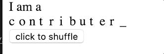

# char-flip
Change characters with flipping animation




# install
```
$ npm install --save number-flip
```

# usage
## import `char-flip`
```
import { Flip } from 'char-flip'
```

## use it!
### create one and make it flip:
```js
new Flip({
  node: $('.flip'),
  from: 'test',
  to: 'nice'
})
```

